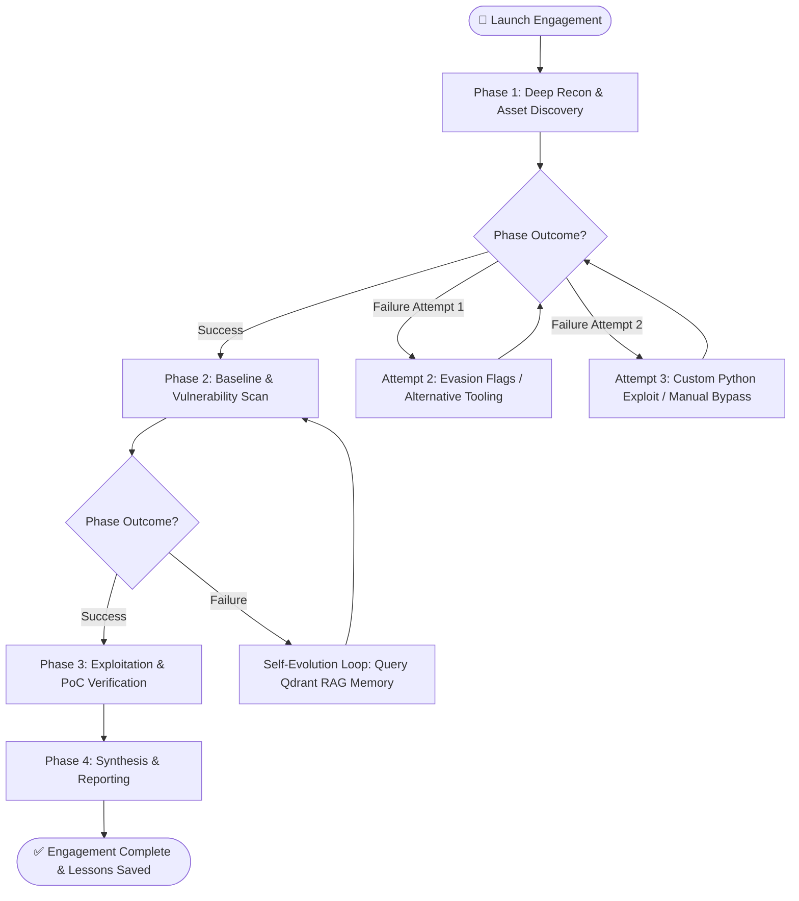

# 🛡️ anve-offsec: Autonomous Bug Bounty & Offensive Security Platform

[](https://github.com/ANVEAI/anve-offsec)
[](https://opensource.org/licenses/Apache-2.0)
[](https://www.docker.com/)
[](https://www.kali.org/)
[](https://fastapi.tiangolo.com/)
[](https://openclaw.ai)
[](https://qdrant.tech/)

> **anve-offsec** is an enterprise-grade, autonomous bug bounty and offensive-security operations platform **proudly developed in India 🇮🇳**. Built for long-running autonomous research and continuous self-evolution, it combines a stateful **Kali Linux core container**, the **Hermes AI Reasoning Brain**, **OpenClaw headless Chromium automation**, **OWASP ZAP vulnerability scanning**, and **Qdrant RAG memory** into a self-improving pentest ecosystem.

---

## 📚 Multipage Technical Documentation Index

Explore the detailed sub-documentation pages for deep technical specifications:

- 🏗️ **[Architecture & Microservice Spec](docs/ARCHITECTURE.md)** — Sidecar isolation, Docker-in-Docker worker spawning, and out-of-band listener ports (`28000–30000`).
- 🧠 **[Hermes AI Reasoning Brain](docs/HERMES_BRAIN.md)** — Multi-turn session persistence (`--resume`), persona hierarchy across 40+ agents, and phase completion signaling.
- 🧬 **[Self-Evolution & Vector RAG](docs/SELF_EVOLUTION.md)** — Qdrant vector memory indexing, confidence score heuristics (`0.7`/`0.85`), and strategy prompt injection.
- 🛡️ **[Defensive Guardrails & Security](docs/GUARDRAILS_SECURITY.md)** — Prompt injection checking, destructive command prevention, exfiltration filtering, and legal scope auditing.
- 🔬 **[Benchmark Case Studies](docs/CASE_STUDIES.md)** — Detailed execution logs & reports for DVWA OWASP Top 10, Metasploitable2, and Auth Wall OpenClaw bypass.
- 🤝 **[Contribution Guidelines](docs/CONTRIBUTING.md)** — How to add new specialized agents, tools, and submit pull requests.

---

## 📸 Key Capabilities at a Glance

- ⏳ **Long-Running Autonomous Engagements**: Executes multi-phase pentests over hours or days with zero context loss and crash-safe state retention.
- 🧬 **Self-Evolving Pentest Engine**: Learns from every execution outcome. Stores successful attack paths in Qdrant RAG memory to automatically improve strategy on future targets.
- 🧠 **Hermes AI Reasoning Brain**: Multi-turn LLM agent executing complex terminal commands, security tools, and custom exploit payloads natively inside Kali Linux.
- 🌐 **OpenClaw Browser Sidecar**: Headless Chromium gateway for complex web interaction, authentication bypass testing, and dynamic DOM crawling.
- ⚡ **OWASP ZAP Integration**: Automated active/passive web application scanning, spidering, and REST API vulnerability discovery via sidecar daemon.
- 🛡️ **Defensive Guardrails & Scope Control**: Input/output protection against prompt injection, destructive shell commands, and out-of-scope testing with audit logs.
- 📊 **Real-Time Control Plane**: Modern FastAPI web interface featuring live Server-Sent Events (SSE) logs, real-time operator instruction injection, and instant run continuations.
- 🧪 **Built-in Lab Environment**: Ships with pre-configured isolated targets (**DVWA** and **Metasploitable2**) for safe local benchmarking and vulnerability research.

---

## ⏳ Long-Running Autonomous Research & Engagement Lifecycle

Traditional pentesting scripts fail on complex targets because they time out or lose context when an approach encounters an obstacle. **anve-offsec** is engineered specifically for **unattended, long-running security engagements**:



### Key Long-Running Features:
- **Adaptive 3-Attempt Retry Escalation**: When a phase fails, the runner escalates from standard tools $\rightarrow$ evasion parameters $\rightarrow$ custom Python exploits.
- **Crash-Safe State Persistence**: Saves engagement state after every turn to `/work/dashboard-logs/<run_id>.engagement.json`. Resumes automatically on container or host restart.
- **Live Mid-Run Operator Steering**: Inject instructions from the dashboard UI mid-engagement without interrupting LLM reasoning context.

---

## ⚖️ Feature Comparison Matrix

| Feature | `anve-offsec` | Traditional Scanners (ZAP/Nessus) | Generic LLM Wrappers |
|---|---|---|---|
| **Execution Engine** | Native Kali Linux Shell + Python | Pre-programmed Rules | Basic Script Generation |
| **Session Memory** | Stateful `--resume` across multi-hour runs | None | Single-turn context window |
| **Self-Evolution** | Qdrant Vector RAG + Strategy Learning | Manual Rule Updates | None |
| **Browser Automation** | OpenClaw Headless Chromium Sidecar | Simple HTTP Crawler | Basic Puppeteer Scripts |
| **Safety Governance** | Prompt Injection + Destructive Command Interception | Target URL Input | No Scope Controls |
| **Operator Steering** | Live Mid-Run Instruction Injection | Hard Stop / Start | Re-run Prompt |

---

## 🏗️ System Architecture & Infrastructure


---

## 🚀 Quick Start Guide

### Prerequisites
- **Docker Desktop** (macOS Apple Silicon / Linux x86_64 / Windows WSL2).
- At least **25 GB** of free disk space (Kali image ~18 GB, OpenClaw ~3.5 GB).
- Python 3.11+ (if running scripts outside Docker).

### 1. Clone & Set Up Environment

```bash
git clone https://github.com/ANVEAI/anve-offsec.git
cd anve-offsec

# Copy environment configuration
cp .env.example .env

# Edit .env and insert your API keys (Kimi / OpenAI / Moonshot)
nano .env
```

### 2. Build & Launch Containers

```bash
# Build and start all microservices
docker compose up -d

# Initialize OpenClaw browser sidecar configurations
./scripts/setup-openclaw.sh
```

### 3. Open Control Plane Dashboard

Navigate to `http://127.0.0.1:8000` in your web browser.

```bash
# Launch a full bug bounty engagement via API or UI:
curl -X POST http://127.0.0.1:8000/api/agents/bug-bounty/run \
  -H "Content-Type: application/json" \
  -d '{"task":"Run a full bug bounty assessment on http://dvwa:8080"}'
```

### 4. Interactive Terminal Access (Hermes TUI)

Want direct terminal interaction with the Hermes AI agent inside Kali?

```bash
./scripts/hermes.sh
```

---

## 🧰 Microservice & Sidecar Reference

| Service | Container Image | Port | Description |
|---|---|---|---|
| **Kali Core** | `kali-ai:latest` | `28000-30000` (OOB) | Full Kali Linux rolling release with security tools and Docker socket access. |
| **Dashboard** | `kali-dashboard:latest` | `8000` | FastAPI control plane with SSE live streaming, targets manager, and scenario builders. |
| **OpenClaw** | `ghcr.io/openclaw/openclaw` | `18789` | Headless Chromium gateway for complex web crawling and interactive DOM automation. |
| **OWASP ZAP** | `ghcr.io/zaproxy/zaproxy:stable` | `8090` | Active & passive web application scanner exposed via REST API. |
| **Qdrant** | `qdrant/qdrant:latest` | `6333 / 6334` | Vector database for storing strategy patterns and past execution RAG memory. |
| **VPN Client** | `dperson/openvpn-client` | N/A | Isolated OpenVPN tunnel container for connecting to CTF lab networks. |
| **DVWA** | `vulnerables/web-dvwa` | `8080` | Damn Vulnerable Web Application local testing target. |
| **Metasploitable** | `tleemcjr/metasploitable2` | `8081` | Metasploitable2 vulnerable target container. |

---

## ⚙️ Configuration Reference

Key tunables can be configured inside `.env`:

| Parameter | Default | Purpose |
|---|---|---|
| `AGENT_TURN_TIMEOUT_SECONDS` | `1800` | Safety timeout for a single agent turn. |
| `AGENT_ENGAGEMENT_MAX_HOURS` | `6` | Wall-clock limit per engagement session (0 = unlimited). |
| `AGENT_MAX_PHASE_ATTEMPTS` | `3` | Maximum retry attempts per attack phase before flagging blocked. |
| `KIMI_API_KEY` | N/A | Kimi / Moonshot AI model API Key. |
| `OPENCLAW_GATEWAY_TOKEN` | N/A | Security secret token for the OpenClaw browser sidecar. |

---

## ⚠️ Legal Disclaimer

> **IMPORTANT**: `anve-offsec` is built strictly for authorized security assessments, penetration testing within explicit scope, educational research, and bug bounty hunting. Operating this software against targets without explicit written authorization is illegal. The creators and contributors assume no liability for misuse or damage caused by this platform.

---

## 📜 License

This project is licensed under the **Apache License 2.0**. See the [LICENSE](LICENSE) file for details.

---

<p align="center">
  <b>Proudly Made in India 🇮🇳 | Built with ❤️ for the Global AI & Cybersecurity Community</b><br>
  <i>Starred the repo? Give it a ⭐️ to support continuous development!</i>
</p>
