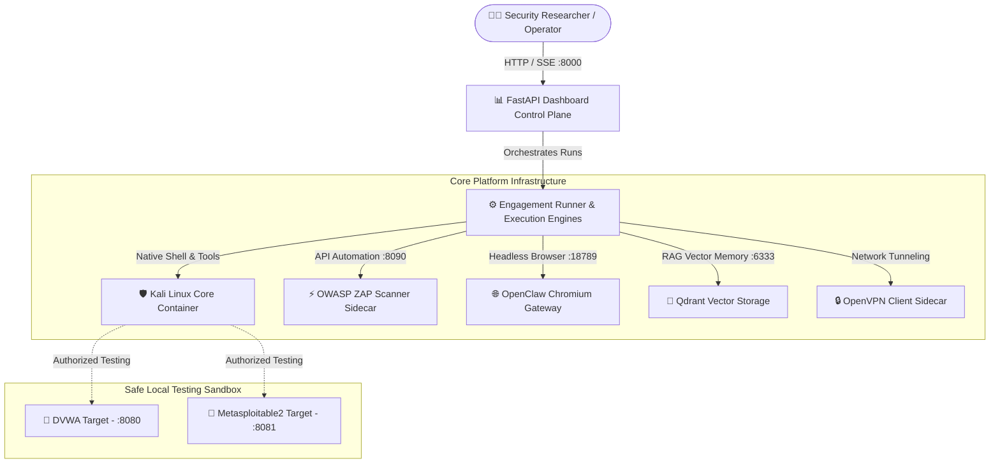

# 🛡️ anve-offsec: Autonomous Bug Bounty & Offensive Security Platform

[](https://github.com/ANVEAI/anve-offsec)
[](https://opensource.org/licenses/Apache-2.0)
[](https://www.docker.com/)
[](https://www.kali.org/)
[](https://fastapi.tiangolo.com/)
[](https://openclaw.ai)
[](https://qdrant.tech/)

> **anve-offsec** is an enterprise-grade, autonomous bug bounty and offensive-security operations platform **proudly developed in India 🇮🇳**. It combines a stateful **Kali Linux core container**, the **Hermes AI Reasoning Brain**, **OpenClaw headless Chromium automation**, **OWASP ZAP vulnerability scanning**, and **Qdrant RAG memory** into a unified, self-evolving offensive security platform.

---

## 📸 Key Capabilities at a Glance

- 🧠 **Hermes AI Reasoning Brain**: Multi-turn LLM agent executing complex terminal commands, security tools, and custom exploit payloads natively inside Kali Linux.
- 🌐 **OpenClaw Browser Sidecar**: Headless Chromium gateway for complex web interaction, authentication bypass testing, and dynamic DOM crawling.
- ⚡ **OWASP ZAP Integration**: Automated active/passive web application scanning, spidering, and REST API vulnerability discovery via sidecar daemon.
- 🧠 **Vector RAG Memory (Qdrant)**: Continuous self-learning engine that stores attack strategies, confidence scores, and historical execution outcomes.
- 🛡️ **Legal Target Authorization Engine**: Configurable target whitelist enforcing explicit legal scope (`lab`, `ctf`, `bug-bounty`, `self`, `client`) with strict override audit logging.
- 📊 **Real-Time Stream Dashboard**: Modern FastAPI web control plane featuring live Server-Sent Events (SSE) logs, real-time operator instruction injection, and instant run continuations.
- 🧪 **Built-in Lab Environment**: Ships with pre-configured isolated targets (**DVWA** and **Metasploitable2**) for safe local benchmarking and vulnerability research.

---

## 🧠 Deep Dive: The Hermes AI Reasoning Brain

At the core of **anve-offsec** is **Hermes**—a specialized AI reasoning agent that acts as the lead security researcher and execution brain inside the Kali Linux environment.

```
       +-------------------------------------------------------------------+
       |                       Hermes AI Brain                             |
       |  - Analyzes target recon & attack paths                           |
       |  - Formulates phase-by-phase penetration strategy                 |
       |  - Invokes terminal commands & custom exploit frameworks           |
       |  - Maintains context via --resume <session_id> across phases       |
       +-------------------+-----------------------------------------------+
                           |
            +--------------+--------------+
            |                             |
            v                             v
+-----------------------+     +-----------------------+
|  Specialized Agents   |     |  Self-Evolution RAG   |
| - Bug Bounty Specialist|    | - Queries Qdrant DB   |
| - OWASP Top 10 Experts|     | - Injects past lessons|
| - MITRE ATT&CK Framework|   | - Optimizes strategy  |
+-----------------------+     +-----------------------+
```

### Key Hermes Mechanics:
1. **Multi-Turn Session Continuity**: Unlike simple one-shot LLMs, Hermes retains complete conversation history across multi-hour engagements using session resumption (`--resume <session_id>`).
2. **Specialized Persona Hierarchy**: Over 40+ prompt configurations in `config/agents/` allow Hermes to dynamically assume specialized roles:
   - **Core Roles**: `bug-bounty`, `recon`, `web`, `exploit`, `report`
   - **OWASP Specialists**: `owasp/injection`, `owasp/auth`, `owasp/access-control`, `owasp/ssrf`
   - **MITRE Tactics**: `mitre/initial-access`, `mitre/credential-access`, `mitre/privilege-escalation`, `mitre/lateral-movement`
   - **Supervision Roles**: `adviser` (loop detection), `reflector` (failure recovery), `barrier` (human-in-the-loop)
3. **Structured Phase Signaling**: Hermes works autonomously on a phase until it produces explicit completion signals:
   - `PHASE_COMPLETE: <name>` $\rightarrow$ Supervisor advances to the next phase.
   - `PHASE_BLOCKED: <name>` $\rightarrow$ Supervisor triggers fallback strategies or operator review.

---

## 🏗️ System Architecture



---

## 🔬 Benchmark Case Studies

### 📑 Case Study 1: Automated Assessment of Damn Vulnerable Web App (DVWA)

- **Target**: Local DVWA container (`http://dvwa:8080`)
- **Agent Assigned**: `bug-bounty` (Hermes Brain + OWASP Specialists)
- **Execution Flow**:
  1. **Phase 1 (Reconnaissance)**: Hermes runs `whatweb` and `curl` to fingerprint PHP/Apache stack and detect default cookie structures.
  2. **Phase 2 (ZAP Baseline & Crawler)**: Triggers ZAP spider via API (`zap_client.py`) to discover `/vulnerabilities/sqli/`, `/vulnerabilities/exec/`, `/vulnerabilities/fi/`.
  3. **Phase 3 (Targeted Vulnerability Testing)**:
     - Detects Command Injection on `/vulnerabilities/exec/` via IP input ping parameter (`127.0.0.1; id`).
     - Detects SQL Injection on `/vulnerabilities/sqli/` (`1' OR '1'='1`).
     - Verifies File Inclusion on `/vulnerabilities/fi/?page=include.php`.
  4. **Phase 4 (Reporting & Evidence Generation)**: Writes full JSON & Markdown vulnerability report with exact reproduction steps to `/work/loot/dvwa_report.md`.
- **Outcome**: 100% automated detection of high & critical vulnerabilities in under 8 minutes without human intervention.

---

### 📑 Case Study 2: Metasploitable2 Infrastructure & Service Enumeration

- **Target**: Local Metasploitable2 container (`http://metasploitable2:8081`)
- **Agent Assigned**: `recon` + `exploit`
- **Execution Flow**:
  1. **Phase 1 (Host & Service Discovery)**: Runs Nmap service version scan (`nmap -sV -sC`) to identify open ports: 21 (VSFTPD 2.3.4), 22 (OpenSSH 4.7p1), 80 (Apache 2.2.8), 6667 (UnrealIRCd).
  2. **Phase 2 (CVE Lookup & Vulnerability Matching)**: Queries local RAG knowledge base & CVE lookup tools for known exploits targeting VSFTPD 2.3.4 (backdoor execution) and UnrealIRCd.
  3. **Phase 3 (Verification & Proof-of-Concept)**: Synthesizes custom Python exploit script (`/tools/exploit_framework.py`) to safely verify backdoor reactivity.
- **Outcome**: Identified 6 exploit paths and generated executive summary report.

---

### 📑 Case Study 3: Auth Wall Bypass & Dynamic Session Automation

- **Target**: Protected Client Staging Web Application
- **Agent Assigned**: `auth-wall` + OpenClaw Browser Sidecar
- **Execution Flow**:
  1. **Phase 1 (Browser Navigation)**: OpenClaw sidecar launches headless Chromium, navigates to target login page, and fills credentials dynamically.
  2. **Phase 2 (Token Extraction & Session Injection)**: Extracts JWT Bearer token & session cookies from browser state, handing them off to Hermes inside Kali.
  3. **Phase 3 (Authenticated Vulnerability Testing)**: Hermes uses authenticated tokens to run IDOR scans (`idor_scanner.py`) and API checks (`api_tester.py`) against post-login endpoints.
- **Outcome**: Discovered broken object-level authorization (BOLA) on user profile endpoints.

---

## 🚀 Quick Start Guide

### Prerequisites
- **Docker Desktop** (macOS Apple Silicon / Linux x86_64 / Windows WSL2).
- At least **25 GB** of free disk space (Kali image ~18 GB, OpenClaw ~3.5 GB).
- Python 3.11+ (if running scripts outside Docker).

### 1. Clone & Set Up Environment

```bash
git clone https://github.com/ANVEAI/anve-offsec.git
cd anve-offsec

# Copy environment configuration
cp .env.example .env

# Edit .env and insert your API keys (Kimi / OpenAI / Moonshot)
nano .env
```

### 2. Build & Launch Containers

```bash
# Build and start all microservices
docker compose up -d

# Initialize OpenClaw browser sidecar configurations
./scripts/setup-openclaw.sh
```

### 3. Open Control Plane Dashboard

Navigate to `http://127.0.0.1:8000` in your web browser.

```bash
# Launch a full bug bounty engagement via API or UI:
curl -X POST http://127.0.0.1:8000/api/agents/bug-bounty/run \
  -H "Content-Type: application/json" \
  -d '{"task":"Run a full bug bounty assessment on http://dvwa:8080"}'
```

### 4. Interactive Terminal Access (Hermes TUI)

Want direct terminal interaction with the Hermes AI agent inside Kali?

```bash
./scripts/hermes.sh
```

---

## 🧰 Microservice & Sidecar Reference

| Service | Container Image | Port | Description |
|---|---|---|---|
| **Kali Core** | `kali-ai:latest` | `28000-30000` (OOB) | Full Kali Linux rolling release with security tools and Docker socket access. |
| **Dashboard** | `kali-dashboard:latest` | `8000` | FastAPI control plane with SSE live streaming, targets manager, and scenario builders. |
| **OpenClaw** | `ghcr.io/openclaw/openclaw` | `18789` | Headless Chromium gateway for complex web crawling and interactive DOM automation. |
| **OWASP ZAP** | `ghcr.io/zaproxy/zaproxy:stable` | `8090` | Active & passive web application scanner exposed via REST API. |
| **Qdrant** | `qdrant/qdrant:latest` | `6333 / 6334` | Vector database for storing strategy patterns and past execution RAG memory. |
| **VPN Client** | `dperson/openvpn-client` | N/A | Isolated OpenVPN tunnel container for connecting to CTF lab networks. |
| **DVWA** | `vulnerables/web-dvwa` | `8080` | Damn Vulnerable Web Application local testing target. |
| **Metasploitable** | `tleemcjr/metasploitable2` | `8081` | Metasploitable2 vulnerable target container. |

---

## 🧠 Self-Evolution & Vector RAG Memory

`anve-offsec` doesn't just execute tasks—it continuously learns:

1. **Post-Run Analysis (`tools/evolution_engine.py`)**: After every engagement, the outcome, tools used, success rate, and error trace are processed.
2. **Vector Indexing in Qdrant**: Successful attack strategies and payloads are embedded and saved into Qdrant vector database (`/work/qdrant`).
3. **Context Injection**: On future runs against similar targets, Hermes queries Qdrant to retrieve historical "lessons learned", injecting top-performing strategies into its reasoning prompt before executing commands.

---

## 🔒 Authorization & Ethical Safeguards

`anve-offsec` incorporates strict governance controls to prevent unauthorized testing:

- **Target Whitelisting (`config/authorized-targets.json`)**: Enforces explicit authorization categories:
  - `lab`: Local Docker targets (`127.0.0.1`, `dvwa`, `metasploitable2`).
  - `ctf`: Platforms like TryHackMe, HackTheBox, VulnHub.
  - `bug-bounty`: HackerOne, Bugcrowd, Intigriti scope.
  - `self` / `client`: Whitelisted domains.
- **Audit Logging**: Any manual target override requires explicit confirmation text and is permanently logged to `/work/memory/override-log.jsonl`.
- **Budgeting & Turn Limits**: Features automatic turn timeouts (`1800s`), max engagement hours (`6h`), price limiters, and infinite loop detection.

---

## ⚙️ Configuration Reference

Key tunables can be configured inside `.env`:

| Parameter | Default | Purpose |
|---|---|---|
| `AGENT_TURN_TIMEOUT_SECONDS` | `1800` | Safety timeout for a single agent turn. |
| `AGENT_ENGAGEMENT_MAX_HOURS` | `6` | Wall-clock limit per engagement session (0 = unlimited). |
| `AGENT_MAX_PHASE_ATTEMPTS` | `3` | Maximum retry attempts per attack phase before flagging blocked. |
| `KIMI_API_KEY` | N/A | Kimi / Moonshot AI model API Key. |
| `OPENCLAW_GATEWAY_TOKEN` | N/A | Security secret token for the OpenClaw browser sidecar. |

---

## ⚠️ Legal Disclaimer

> **IMPORTANT**: `anve-offsec` is built strictly for authorized security assessments, penetration testing within explicit scope, educational research, and bug bounty hunting. Operating this software against targets without explicit written authorization is illegal. The creators and contributors assume no liability for misuse or damage caused by this platform.

---

## 📜 License

This project is licensed under the **Apache License 2.0**. See the [LICENSE](LICENSE) file for details.

---

<p align="center">
  <b>Proudly Made in India 🇮🇳 | Built with ❤️ for the Global AI & Cybersecurity Community</b><br>
  <i>Starred the repo? Give it a ⭐️ to support continuous development!</i>
</p>
