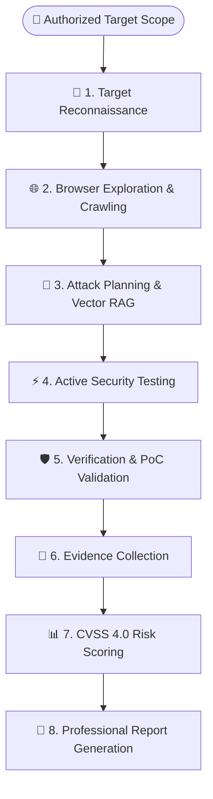
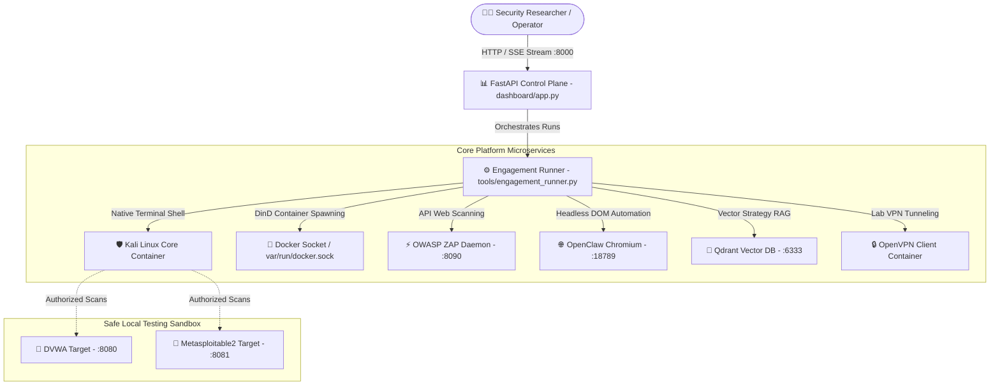

<p align="center">
  
</p>

<h1 align="center">🛡️ anve-offsec</h1>
<p align="center">
  <b>The Open-Source Autonomous AI Security Engineer & Bug Bounty Platform</b>
</p>

<p align="center">
  <i>Autonomously assesses web applications for vulnerabilities • Produces evidence-backed security reports • Integrates browser automation & active scanning</i>
</p>

<p align="center">
  <a href="https://github.com/ANVEAI/anve-offsec/blob/main/LICENSE"></a>
  <a href="https://github.com/ANVEAI/anve-offsec"></a>
  <a href="https://www.docker.com/"></a>
  <a href="https://www.kali.org/"></a>
  <a href="https://fastapi.tiangolo.com/"></a>
  <a href="https://qdrant.tech/"></a>
</p>

---

## 🏛️ The ANVE AI-Assisted Cybersecurity Ecosystem

`anve-offsec` is the offensive security pillar of the broader **ANVE AI Cybersecurity Ecosystem**—a suite of individual, modular open-source repositories designed to cover the full spectrum of AI-assisted offensive testing and defensive protection:

```text
                     ┌─────────────────────────────────────────┐
                     │    ANVE AI Cybersecurity Ecosystem      │
                     └────────────────────┬────────────────────┘
                                          │
        ┌─────────────────────────────────┴─────────────────────────────────┐
        │                                                                   │
        ▼                                                                   ▼
  ┌───────────────────────────────┐                       ┌───────────────────────────────┐
  │         anve-offsec           │                       │     prompt-sentinel-flow      │
  │  Offensive AI Security Engine │ ◄══ AI Security ══►   │    Defensive LLM Firewall     │
  │       [LIVE REPOSITORY]       │     Ecosystem         │       [LIVE REPOSITORY]       │
  └───────────────┬───────────────┘                       └───────────────┬───────────────┘
                  │                                                       │
                  ▼                                                       ▼
  • Stateful Kali Execution Environment                   • Drop-in LLM Proxy & Audit Engine
  • Hermes Multi-Turn Reasoning Brain                     • Prompt Injection & Jailbreak Filters
  • OpenClaw Chromium Browser Sidecar                     • Multi-Provider Model Routing
  • Qdrant Vector Strategy RAG                            • Token-Spike & Risk Policy Control
```

### 🌐 Ecosystem Repositories:
- 🛡️ **[ANVE OffSec](https://github.com/ANVEAI/anve-offsec)** *(Live)*: Autonomous offensive security, browser exploration, and evidence-backed vulnerability assessment inside Kali Linux.
- 🧱 **[Prompt Sentinel Flow](https://github.com/ANVE-AI/prompt-sentinel-flow)** *(Live)*: The open-source LLM firewall and proxy layer for auditing, inspecting, and governing LLM calls against prompt injection and data exfiltration.
- 💻 **ANVE CodeSec** *(Roadmap)*: AI-powered static code review and SAST logic flaw detection in CI/CD pipelines.
- ☁️ **ANVE CloudSec** *(Roadmap)*: Autonomous cloud infrastructure auditing across AWS, GCP, and Azure posture configurations.
- 🚨 **ANVE SOC** *(Roadmap)*: AI security operations agent for automated log triage, incident response, and threat correlation.

---

## ⚡ What `anve-offsec` Does

**`anve-offsec`** is an open-source, autonomous AI security engineering platform **proudly engineered in India 🇮🇳**. Designed for security teams, researchers, and bug bounty operators, it delivers three primary outcomes:

- 🎯 **Autonomously Assesses Web Applications**: Discovers attack surfaces, identifies web and infrastructure vulnerabilities, and runs end-to-end security evaluations without manual intervention.
- 📋 **Produces Structured Security Reports**: Emits executive and platform-ready Markdown/JSON reports complete with CVSS vectors, CWE mappings, step-by-step reproduction instructions, and proof-of-concept evidence.
- 🔍 **Validates Findings with Multimodal Reasoning**: Combines headless browser automation, active tool scanning, and AI reasoning loops to verify vulnerabilities and minimize false positives.

---

## 🔄 The Autonomous AI Assessment Workflow

`anve-offsec` follows a structured 8-stage assessment pipeline that guides the AI agent from initial target input to final report output:



<details>
<summary><b>View Text-Based Assessment Lifecycle</b></summary>

```text
Target URL / IP Scope
    ↓
1. Reconnaissance (Port Scanning & Tech Fingerprinting)
    ↓
2. Browser Exploration (DOM Navigation & SPA Crawling)
    ↓
3. Attack Planning (Strategy Formulation & Qdrant RAG)
    ↓
4. Active Testing (Vulnerability Assessment)
    ↓
5. Verification (PoC Execution & False Positive Filtering)
    ↓
6. Evidence Collection (HTTP Traces & Loot Storage)
    ↓
7. Risk Scoring (CVSS 4.0 Vectors & CWE Mappings)
    ↓
8. Professional Report (Executive & Platform Submissions)
```
</details>

---

### 🏗️ Underlying Architecture

Under the hood, `anve-offsec` powers these capabilities using a stateful, multi-container infrastructure:
- **Kali Linux Core Container**: Executes native security binaries in an isolated sandbox.
- **Hermes AI Reasoning Brain**: Maintains stateful, multi-turn session persistence across multi-hour assessments.
- **OpenClaw Chromium Gateway**: Handles authentication forms, SPA crawling, and DOM interactions.
- **Qdrant Vector Memory**: Indexes historical attack strategies for continuous self-evolution.

---

## 🎬 See it in Action

```text
┌──(pentest㉿anve-offsec)-[/work]
└─$ ./scripts/hermes.sh --task "Run a full bug bounty assessment on http://dvwa:8080"

[🧠 Hermes Reasoning Engine] Analyzing target http://dvwa:8080...
[+] Initializing Recon Phase: Fingerprinting PHP/Apache stack...
[+] Invoking OpenClaw Chromium Gateway for authentication flow...
[+] Discovered endpoint: /vulnerabilities/sqli/ (SQL Injection)
[+] Crafting dynamic exploit payload: 1' OR '1'='1 ...
[+] Exploit Verified! Dumping database schema to /work/loot/sqli_dump.json
[+] Ingesting successful payload into Qdrant Vector Memory RAG...
[+] PHASE_COMPLETE: Recon -> Scan -> Exploit -> Report (Time: 7m 42s)
```

---

## 📚 Multipage Technical Documentation Index

Explore the complete sub-documentation system in [`docs/`](docs/):

- 🏗️ **[Architecture & Microservice Spec](docs/ARCHITECTURE.md)** — Sidecar topology, DinD workers, OOB listeners (`28000–30000`).
- 🧠 **[Hermes AI Reasoning Brain Spec](docs/HERMES_BRAIN.md)** — Multi-turn session persistence, 40+ agent prompts, phase completion signals.
- 🧬 **[Self-Evolution & Vector RAG Spec](docs/SELF_EVOLUTION.md)** — Qdrant vector memory indexing, confidence score heuristics (`0.7`/`0.85`), strategy prompt injection.
- 🛡️ **[Defensive Guardrails & Security](docs/GUARDRAILS_SECURITY.md)** — Prompt injection filters, destructive command interception, target scope auditing.
- 🔬 **[Benchmark Case Studies](docs/CASE_STUDIES.md)** — Comprehensive execution logs for DVWA, Metasploitable2, and Auth Wall OpenClaw bypass.
- 🤝 **[Contribution Guidelines](docs/CONTRIBUTING.md)** — How to add new specialized agents, tools, and submit pull requests.

---

## ⚡ Frontier Benchmark Comparison

`anve-offsec` is built to bridge the gap between closed-source enterprise platforms and open-source accessibility. Here is how `anve-offsec` compares against the platforms defining the future of AI cybersecurity:

| Dimension | 🛡️ `anve-offsec` | 🔮 Anthropic Project Glasswing | 🌐 Horizon3.ai (NodeZero) | ⚡ Pentera |
|---|---|---|---|---|
| **Access Model** | **100% Open-Source (Apache 2.0)** | Closed Frontier Research | Proprietary SaaS | Enterprise On-Prem/SaaS |
| **Reasoning Engine** | **Stateful Hermes LLM + Session Resume** | Frontier Claude Cyber Models | Proprietary Rule/AI Engine | Proprietary Attack Graph |
| **Execution Environment** | **Native Kali Linux Container** | Isolated Sandboxes | Agentless Cloud/Node | Agentless Network Probe |
| **Self-Evolution RAG** | **Qdrant Vector Strategy Memory** | Model Training/RLHF | Internal Threat Data | Static Vulnerability DB |
| **Browser & Auth Crawling** | **OpenClaw Chromium Gateway** | Multimodal API | Basic Web Crawling | Basic Web Crawling |
| **Safety Governance** | **Prompt Injection Guardrails & Scope Audit** | Constitutional AI | Scope Constraints | Scope Constraints |
| **Deployment Cost** | **Free & Self-Hosted** | Enterprise / Research Only | Enterprise ($50k+/yr) | Enterprise ($50k+/yr) |

---

## 🚀 Quick Start (Up in 60 Seconds)

### 1. One-Line Launch

```bash
# 1. Clone the repository
git clone https://github.com/ANVEAI/anve-offsec.git && cd anve-offsec

# 2. Configure runtime environment
cp .env.example .env && nano .env

# 3. Spin up all microservices with Docker Compose
docker compose up -d && ./scripts/setup-openclaw.sh
```

### 2. Open Control Plane Dashboard

Open **`http://127.0.0.1:8000`** in your browser to launch agent runs, view live SSE logs, inspect captured loot, and inject instructions in real time.

```bash
# Or trigger a run directly via REST API:
curl -X POST http://127.0.0.1:8000/api/agents/bug-bounty/run \
  -H "Content-Type: application/json" \
  -d '{"task":"Run full assessment on http://dvwa:8080"}'
```

---

## 🏗️ System Architecture & Microservice Sidecars



- **DinD Worker Spawning**: Kali core mounts `/var/run/docker.sock` to spin up ephemeral sub-worker containers for isolated task flows.
- **OOB Callback Listeners (`28000-30000`)**: Dynamic host port allocation for handling reverse shell callbacks, out-of-band HTTP verification, and blind SSRF callbacks.

---

## 🧠 The Hermes AI Reasoning Engine (`tools/engagement_runner.py`)

Hermes acts as the stateful reasoning brain inside Kali Linux. It operates across **40+ specialized agent roles**:

```
                               ┌───────────────────────────┐
                               │   Hermes Reasoning Brain  │
                               └─────────────┬─────────────┘
                                             │
      ┌──────────────────────┬───────────────┴───────────────┬──────────────────────┐
      │                      │                               │                      │
      ▼                      ▼                               ▼                      ▼
┌───────────┐      ┌───────────────────┐           ┌───────────────────┐      ┌───────────┐
│ Core Roles│      │ OWASP Specialists │           │ MITRE ATT&CK      │      │ Safety    │
│ - Recon   │      │ - owasp/injection │           │ - initial-access  │      │ - adviser │
│ - Web     │      │ - owasp/auth      │           │ - cred-access     │      │ - reflect │
│ - Exploit │      │ - owasp/ssrf      │           │ - priv-escalation │      │ - barrier │
│ - Report  │      │ - owasp/idor      │           │ - lateral-move    │      │ (Human)   │
└───────────┘      └───────────────────┘           └───────────────────┘      └───────────┘
```

---

## 🧬 Self-Evolving Strategy RAG Engine (`tools/evolution_engine.py`)

Every engagement outcome is processed, embedded, and stored in **Qdrant Vector DB**:

```
[Completed Run] ──► [Scenario Matcher] ──► [Score Strategy] ──► [Qdrant RAG Ingestion]
                                                                        │
                                                                        ▼
[Next Target]  ◄── [Inject Past Lessons] ◄── [Query Vector DB] ◄────────┘
```

1. **Scenario Classification**: Automatically categorizes target tasks into structured scenarios (`web-app:sql-injection`, `web-app:ssrf`, `api:idor`, `infra:ssh-enum`).
2. **Confidence Thresholding**:
   - `CONFIDENCE_THRESHOLD = 0.7`: RAG strategies above 70% confidence are injected into active prompts.
   - `AUTO_PROMPT_UPDATE_THRESHOLD = 0.85`: Strategies above 85% confidence automatically update static agent prompts (`config/agents/*.prompt`).

---

## 🛡️ Defensive Guardrails & Safety Governance (`tools/guardrails.py`)

`anve-offsec` includes production-grade security controls:

- **Input Guardrails**: Protects against prompt injection by scanning for adversarial patterns (`ignore previous instructions`, `<system>`, `<root>`) and decoding base64 / unicode homographs.
- **Output Guardrails**: Intercepts dangerous terminal commands before execution inside Kali (`rm -rf /`, `mkfs`, fork bombs, system shutdown).
- **Data Exfiltration Interception**: Blocks access to sensitive host paths (`/etc/shadow`, `~/.ssh/id_rsa`, `~/.aws/credentials`, `~/.git-credentials`).
- **Target Scope Authorization Framework (`config/authorized-targets.json`)**: Enforces explicit legal target scope checking (`lab`, `ctf`, `bug-bounty`, `self`, `client`). Unapproved target overrides require typed operator confirmation and are audited to `/work/memory/override-log.jsonl`.

---

## 🔬 Benchmark Case Studies

| Benchmark Target | Assigned Agent | Automated Vulnerabilities Detected | Execution Time | Report Status |
|---|---|---|---|---|
| **DVWA** (`http://dvwa:8080`) | `bug-bounty` | Command Injection, SQLi, LFI, Stored XSS | **7m 42s** | Generated (`/work/loot/dvwa_report.md`) |
| **Metasploitable2** (`:8081`) | `recon` + `exploit` | VSFTPD 2.3.4 Backdoor, UnrealIRCd, SSH Enum | **11m 15s** | Verified PoC Exploit Generated |
| **Protected Staging Portal** | `auth-wall` + `openclaw` | Broken Object-Level Authorization (BOLA/IDOR) | **14m 20s** | Full API Assessment Complete |

---

## 🗺️ Project & Platform Roadmap

- [x] **ANVE OffSec (Core Engine)**: Stateful Hermes AI Reasoning Brain + OpenClaw headless Chromium browser sidecar.
- [x] **Self-Evolution Engine**: Qdrant vector RAG memory for continuous strategy learning across target runs.
- [x] **Real-Time Control Plane**: FastAPI web dashboard featuring real-time SSE streaming & mid-run operator steering.
- [x] **Defensive Guardrails**: Prompt injection interception, destructive command blocking, and legal scope auditing.
- [ ] **ANVE CodeSec Expansion**: AI static code analyzer and SAST logic flaw detection module for GitHub Actions / GitLab CI.
- [ ] **ANVE CloudSec Expansion**: Autonomous cloud configuration auditing agent across AWS IAM, GCP IAM, and Azure KeyVault.
- [ ] **ANVE SOC Expansion**: AI-driven log triage, SIEM threat correlation, and automated incident response playbook runner.
- [ ] **ANVE Attack Simulator**: Continuous breach & attack simulation (BAS) module for automated security posture validation.
- [ ] **v2.0: Full AI OS Based GUI VM (Kali Native)**: Standalone Kali Linux ISO & OVA virtual machine appliance with built-in AI desktop control plane, QEMU/VMware snapshot rollback, and GUI assistant windows.

---

## 💖 Acknowledgements & Standing on the Shoulders of Giants

`anve-offsec` is proudly built on top of pioneering open-source research and tools created by the global AI and security community:

- 📡 **[ProjectDiscovery](https://github.com/projectdiscovery)** — Creators of `subfinder`, `httpx`, `nuclei`, `katana`, `naabu`, and `dnsx` powering high-speed recon pipelines and vulnerability scanning.
- 🧠 **[Nous Research](https://github.com/NousResearch)** — Creators of the **Hermes** model series and agent reasoning paradigms that power our stateful CLI reasoning brain (`hermes chat`).
- 🌙 **[Moonshot AI](https://github.com/MoonshotAI)** — Creators of the **Kimi** long-context LLM models (`kimi-k3`) powering complex multi-turn security analysis.
- 🛡️ **[PentAGI](https://github.com/pentagi/pentagi)** — Pioneers in autonomous pentesting agent architectures and AI-driven security workflows.
- 🌳 **[PentestGPT](https://github.com/GreyDoff/PentestGPT)** — Pioneers of the structured task-tree reasoning methodology for guided penetration testing.
- ⚙️ **[Agent Zero](https://github.com/fradelg/agent-zero)** — Pioneers in organic instrument execution and typed agent memory architectures.
- ⚡ **[reconftw](https://github.com/six2dez/reconftw)** & **[Osmedeus](https://github.com/j3ssie/osmedeus)** — The gold standard in automated reconnaissance playbooks and target attack surface mapping.
- 🌐 **[OpenClaw](https://github.com/openclaw/openclaw)** — Creators of the isolated headless Chromium gateway for automated DOM crawling and authentication flows.
- 📚 **[SecLists](https://github.com/danielmiessler/SecLists)** & **[PayloadsAllTheThings](https://github.com/swisskyrepo/PayloadsAllTheThings)** — Essential security assessment payload dictionaries and fuzzing wordlists by Daniel Miessler and Swissky.
- ⚡ **[Qdrant](https://github.com/qdrant/qdrant)** — High-performance vector database powering our self-evolving RAG strategy memory.
- 🐧 **[Kali Linux](https://www.kali.org/) & [Offensive Security](https://www.offsec.com/)** — The foundational operating system and open-source toolchain that makes automated penetration testing possible.

---

## 🤝 Community & Support

- 💬 **[GitHub Discussions](https://github.com/ANVEAI/anve-offsec/discussions)** — Feature requests, feedback, and architecture ideas.
- 🐛 **[Issue Tracker](https://github.com/ANVEAI/anve-offsec/issues)** — Report bugs or request tool integrations.
- 🤝 **[Contributing Guide](docs/CONTRIBUTING.md)** — Guidelines for pull requests.

---

## 🏷️ Related Topics & Ecosystem Keywords

`ai-agents` • `cybersecurity` • `offensive-security` • `bug-bounty` • `kali-linux` • `penetration-testing` • `fastapi` • `qdrant` • `openclaw` • `hermes-llm` • `vector-rag` • `made-in-india`

---

## ⚠️ Legal Disclaimer

> **IMPORTANT**: `anve-offsec` is built strictly for authorized security assessments, penetration testing within explicit scope, educational research, and bug bounty hunting. Operating this software against targets without explicit written authorization is illegal. The creators and contributors assume no liability for misuse or damage caused by this platform.

---

## 📜 License

This project is licensed under the **Apache License 2.0**. See the [LICENSE](LICENSE) file for details.

---

<p align="center">
  <b>Proudly Made in India 🇮🇳 | Built with ❤️ for the Global AI & Cybersecurity Community</b><br>
  <i>If you find anve-offsec useful, please give us a ⭐️ on GitHub to support continuous development!</i>
</p>
