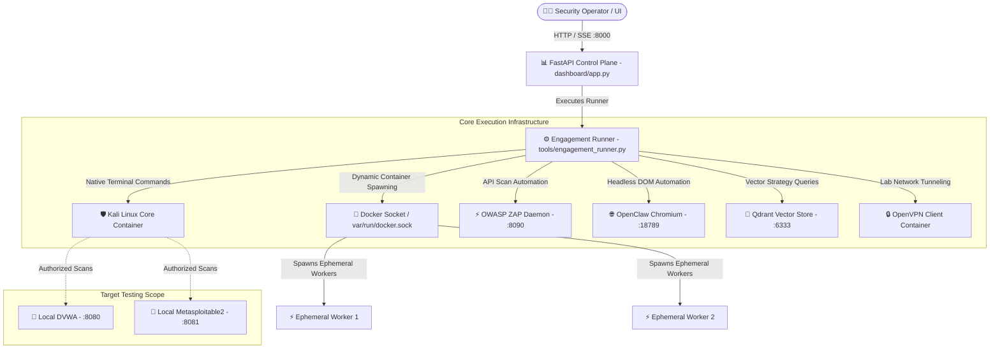

# 🏗️ anve-offsec Architecture & Microservice Specification

This document provides a comprehensive technical breakdown of **anve-offsec**'s multi-container infrastructure, sidecar isolation pattern, Docker socket worker execution, and out-of-band (OOB) network listening model.

---

## 📐 System Topology

---

## 🐳 Microservice Specifications

### 1. **Kali Core Container (`kali-ai:latest`)**
- **Base OS**: Native `kalilinux/kali-rolling` (Apple Silicon arm64 & Linux x86_64).
- **Security Capabilities**:
  - `NET_ADMIN`: For network interface manipulation and packet routing.
  - `NET_RAW`: For low-level raw socket manipulation (`nmap`, `masscan`, `hping3`).
- **Volume Mounts**:
  - `/work`: Persistent workspace for loot, scan output, and logs.
  - `/tools`: Execution python modules (mounted read-only `:ro`).
  - `/var/run/docker.sock`: Enables Docker-in-Docker ephemeral sub-worker container spawning.

### 2. **FastAPI Control Plane (`kali-dashboard:latest`)**
- **Port**: `127.0.0.1:8000`
- **Role**: Exposes REST API endpoints and Server-Sent Events (SSE) log streaming (`/api/runs/{run_id}/stream`).
- **Real-Time Steering**: Accepts operator mid-run instructions via `/api/runs/{run_id}/instructions` and injects them between turn iterations.

### 3. **OpenClaw Chromium Sidecar (`ghcr.io/openclaw/openclaw`)**
- **Port**: `127.0.0.1:18789`
- **Role**: Isolated headless Chromium browser gateway. Handles authentication forms, session cookie extraction, DOM navigation, and SPA crawling.
- **Security Isolation**: `cap_drop: ALL`, `NET_BIND_SERVICE`.

### 4. **OWASP ZAP Daemon (`ghcr.io/zaproxy/zaproxy:stable`)**
- **Port**: `127.0.0.1:8090`
- **Role**: Headless ZAP daemon running active & passive web vulnerability scanning, AJAX spidering, and OpenAPI/Swagger endpoint discovery.

### 5. **Qdrant Vector Database (`qdrant/qdrant:latest`)**
- **Ports**: `127.0.0.1:6333` (HTTP) / `127.0.0.1:6334` (gRPC)
- **Role**: Stores high-dimensional vector embeddings of past attack strategies, tool outcomes, and vulnerability bypass patterns for RAG retrieval.

---

## 📡 Out-of-Band (OOB) Listener Architecture

During security assessments, automated exploits and vulnerability checks frequently require **out-of-band callbacks** (reverse shells, blind SSRF verification, DNS exfiltration).

- **Host Port Range**: `28000–30000` is mapped directly from host to Kali core container.
- **OOB Client (`tools/oob_client.py`)**: Spawns ephemeral HTTP/DNS listeners on allocated ports to capture out-of-band callbacks automatically during testing.
